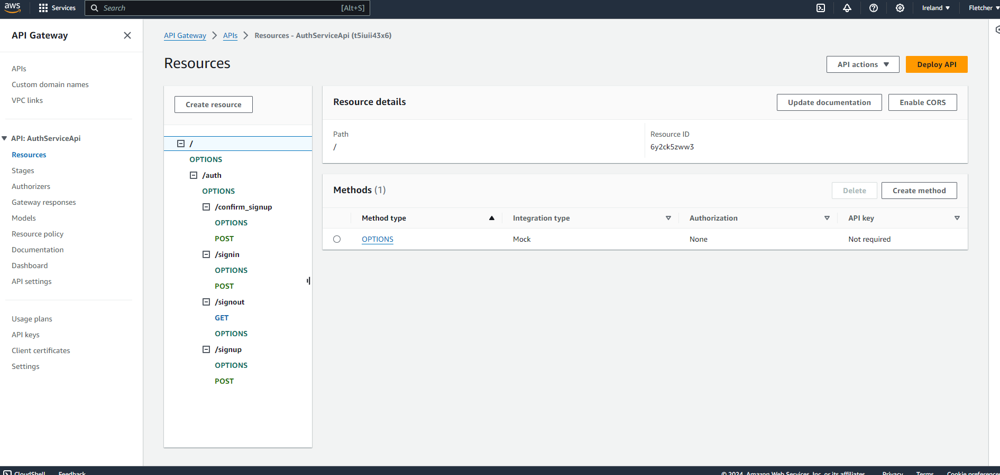
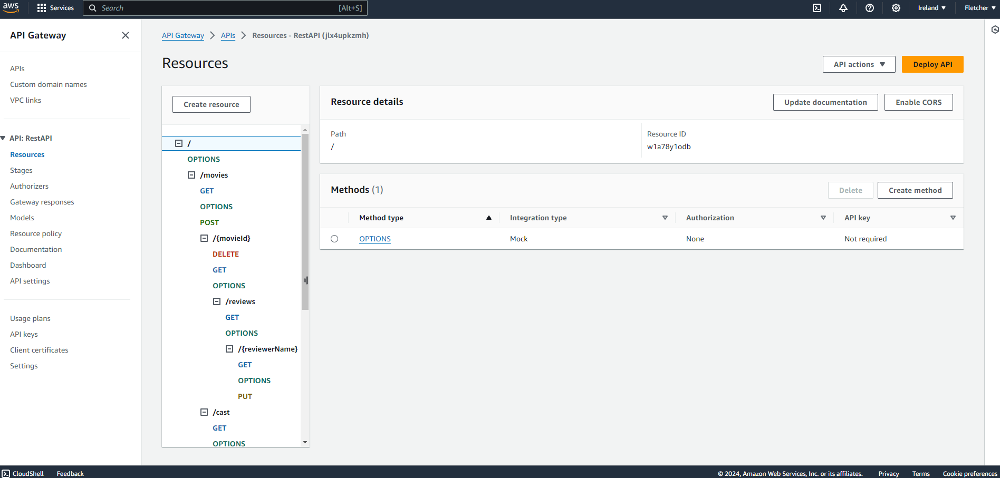
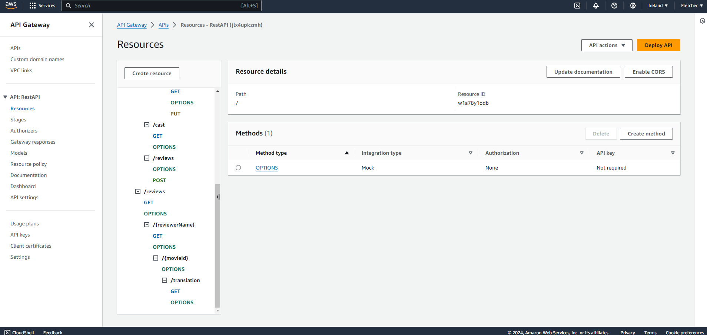

Serverless REST Assignment.
Name: Ilmam Farizan Auric

Video demonstration: https://youtu.be/wZPRGY4CpbM

This repository contains an implementation of a serverless REST API for the AWS platform. The CDK framework is used to provision its infrastructure. The API's domain context is movie reviews.

API endpoints.

- POST /movies/reviews - add a movie review.

- GET /movies/{movieId}/reviews - Get all the reviews for a movie with the specified id.

- GET /movies/{movieId}/reviews?minRating=n - Get all the reviews for the film with the specified ID whose rating was higher than the minRating.

- GET /movies/{movieId}/reviews/{reviewerName} - Get the review for the movie with the specified movie ID and written by the named reviewer.

- PUT /movies/{movieId}/reviews/{reviewerName} - Update the text of a review.

- GET /movies/{movieId}/reviews/{year} - Get the reviews written in a specific year for a specific movie.

- GET /reviews - Get all the movies reviews

- GET /reviews/{reviewerName} - Get all the reviews written by a specific reviewer.

- GET /reviews/{reviewerName}/{movieId}/translation?language=code - Get a translated version of a movie review using the movie ID and reviewer name as the identifier.

API Gateway

Authorization API

REST API

Postman Structuring

Independent learning.
I could not get the translation API working as it keeps on returning 500 error. However, my code is there for this API.
